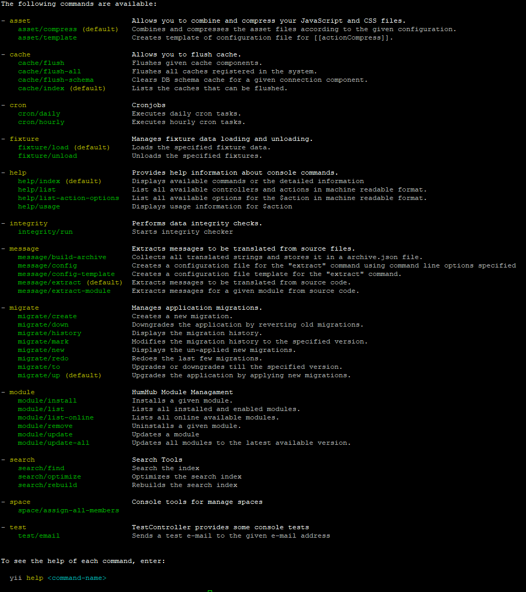

Console
=======

Some administrative tasks can also or exclusively be executed by console. All available console commands can be displayed
by executing the following command within the `protected` directory of your humhub installation.

```
php yii
```



