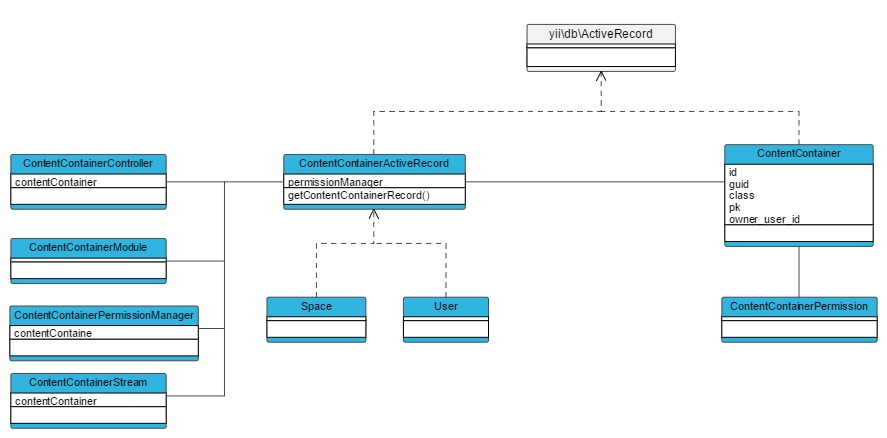

Content
=======

## ContentContainer

A [[humhub\modules\content\models\ContentContainer|ContentContainer]] in HumHub is the base concept for assigning content to a specific container instance.
A [[humhub\modules\content\models\ContentContainer|ContentContainer]] is assigned with a unique guid, which is used in controllers to identify the context of its actions.
Currently there are two types of ContentContainer:
 
- [[humhub\modules\user\models\User|User]]
- [[humhub\modules\space\models\Space|Space]]



> Note: It's not possible to create own ContentContainer classes, yet.

### ContentContainerController

The [[humhub\modules\content\components\ContentContainerController|ContentContainerController]] class should be extended by controllers, which are working in the context of a [[humhub\modules\content\models\ContentContainer|ContentContainer]].
A [[humhub\modules\content\components\ContentContainerController|ContentContainerController]] will automatically search a **sguid** (Space) or **uguid** (User) request parameter for every request and will instantiate the associated [[humhub\modules\content\models\ContentContainer|ContentContainer]].

The [[humhub\modules\content\components\ContentContainerController|ContentContainerController]] provides common tasks like:

- Automatic container loading based on URL
- Access checks
- Layout selection based on container type (User or Space)
- Create URL's for the given ContentContainer

For example,

```php
class ExampleController extends \humhub\modules\content\components\ContentContainerController
{
    public function actionIndex()
    {
        if ($this->contentContainer instanceof Space) {
            //Space related stuff...
        }
    }
}
```

Links to a [[humhub\modules\content\components\ContentContainerController|ContentContainerController]] actions have to be provided with a sguid or uguid parameter, this can either be done by hand or by using a ContentContainer's `createUrl()` method:

```php
 //Direct ContentContainer call
 $space->createUrl('/module/controller/action');

 //Within a ContentContainerController:
 $this->contentContainer->createUrl('/module/controller/action');
```

> Note: A request for a [[humhub\modules\content\components\ContentContainerController|ContentContainerController]] action without a sguid or uguid parameter will fail!

### ContentContainerActiveRecord

Each ContentContainer class is derived from [[\humhub\modules\content\components\ContentContainerActiveRecord]].
Beside others, this abstract class provides the following functionality:

- Permission Management
- Getter for Profile-/BannerImage

TBD (URL, AccessChecking, ProfileImage)

### ContentContainerModule

If a module should be shown in the content containers module section, the module class must extend [[humhub\modules\content\components\ContentContainerModule]].
A ContentContainerModule can be enabled or disabled for a specific ContentContainer. The calendar module, for example, can be enabled for a specific space or a specific user account.

If you're working with content or other persistent data, make also sure to delete it when the module is disabled on a content container. Do this by overwriting the method [[humhub\modules\content\components\ContentContainerModule::disableContentContainer]].

See [[humhub\modules\content\components\ContentContainerModule]] class for a full list of  options.

Example of a modules `Module.php` file:

```php
class Module extends \humhub\modules\content\components\ContentContainerModule
{

    public function getContentContainerTypes()
    {
        //This content container can be assigned to Spaces and User
        return [
            Space::className(),
            User::className(),
        ];
    }

    public function disable()
    {
        // Clear all Module data and call parent disable
        parent::disable();
    }

    public function disableContentContainer(ContentContainerActiveRecord $container)
    {
        parent::disableContentContainer($container);
        //Here you can clear all data related to the given container
    }

    public function getContentContainerDescription(ContentContainerActiveRecord $container)
    {
        if ($container instanceof Space) {
            return Yii::t('MyModule.base', 'Description related to spaces.');
        } elseif ($container instanceof User) {
            return Yii::t('MyModule.base', 'Description related to user.');
        }
    }
```

### ContentContainerPermissionManager

Beside permissions for groups, you can assign permissions to a ContentContainer.

(TBD link to permissions docs)

### ContentContainerPermission

(TBD)

### ContentContainerStream

(TBD)

## Content

TBD

### ContentActiveRecord

Each Content ActiveRecord (derived from [[\humhub\modules\content\components\ContentActiveRecord]]) is automatically linked to a [[humhub\modules\content\models\Content]] record via the *content* Attribute. 

This Content record holds all neccessary informations and provides common methods:

- ContentContainer which the Content belongs to
- Meta Informations (created_at, created_by, updated_at, updated_by)
- Wall Assignments / Methods
- Archiving / Sticking
- And more...

If you're implementing an ActiveRecord based on [[humhub\modules\content\components\ContentContainerActiveRecord]] you need to implement following abstract methods:

- getContentName() - Returns the displayed name of the Content (e.g. Post or Poll)
- getContentDescription() - Returns a preview of the Content - which is used in Notifications for example.

Example:

```php
 (TBD)

```


#### Wall/Stream Output


#### Querying Content

If you're calling find() on a [[\humhub\modules\content\components\ContentActiveRecord]] instance you'll get an special [[\humhub\modules\content\components\ActiveQueryContent]] which provides additional method to select content.

- contentContainer($container) - Find content only inside a given container
- readable($user) - Return only user readable content
- ...

#### Permissions

TBD (Read Permissions not enhanceable)


### Controller

TBD

## ContentAddon

TBD

- Always linked to particual Content, inherits access rules from it
- Examples: Like, File, Comment
- Can be nested (e.g. Container -> Content -> Addon (Comment) -> Addon (Like)

### ActiveRecord

TBD

Provides access to the related content via *content *Attribute

### Controller

TBD
