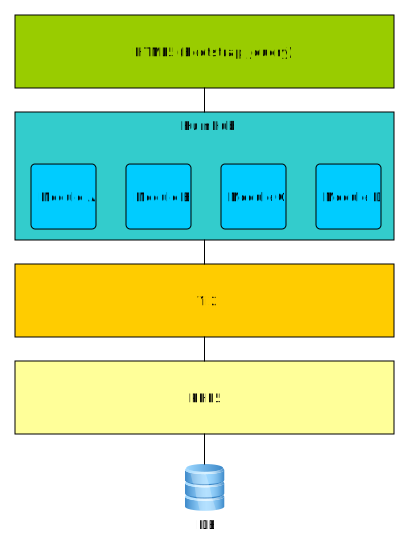

Overview
========

## Getting Started

- HumHub is based on Yii 2.0 PHP Framework (http://www.yiiframework.com/)
- [The Definitive Guide to Yii 2.0](http://www.yiiframework.com/doc-2.0/guide-index.html) 

## Application Overview

Humhub is based on _PHP5_ and _Yii2_ and leverages the highly modular and flexible nature of _Yii_.
Before learning about the internals of HumHub, you should be familiar with the basic concepts of
[Yii](http://www.yiiframework.com/doc-2.0/guide-README.html "Yii Guide").



The HumHub core contains several core modules as well as extended Yii components:

**Core Components:**

 - [[humhub\components\ActiveRecord]]
 - [[humhub\components\Application]]
 - [[humhub\components\Controller]]
 - [[humhub\components\Migration]]
 - [[humhub\components\Module]]
 - [[humhub\components\ModuleManager]]
 - [[humhub\components\Request]]
 - [[humhub\components\Theme]]
 - [[humhub\components\View]]
 - [[humhub\components\Widget]]

**Core Modules:**

 - **activity:**  User/Space activities
 - **admin:**  Responsible for admin/configuration related issues
 - **comment:**  Content addon for commenting
 - **content:**  Base module for all content types (Post,Wiki,...) 
 - **dashboard:**  Dashboard related functionality
 - **directory:**  Directory related functionality
 - **file:**  Basic file module for accessing the filesystem
 - **installer:**  HumHub installer module
 - **like:**  Content addon for likes
 - **notification:**  User Notifications
 - **post:**  Simple user-post related functionality
 - **search:**  Luceene Search Module
 - **space:**  Space related functionality
 - **tour:**  HumHub user-guide
 - **user:**  Basic user module

## Development Environment Notes

- Use Composer Installation as described in the [Installation Guide](admin-installation.md#via-gitcomposer)
- Switch to development mode in ``index.php`` (described [here](admin-installation.md#disable-errors-debugging))
- Disable Caching under **Administration -> Settings -> Caching -> None**

## Enable Yii Debug Module

Add following block to your local web configuration (/protected/config/web.php)

```php
<?php
return [
    // ...
    'bootstrap' => ['debug'],
	'modules' => [
		// ...
    
	    'debug' => [
	        'class' => 'yii\debug\Module',
	        'allowedIPs' => ['127.0.0.1', '::1'],
	    ],

		// ...
	]
];
?>
```

## Enable Gii 

### Web

Add following block to your local web configuration (/protected/config/web.php)

```php
return [
     // ...
	 'modules' => [
		// ...
    
	    'gii' => [
	        'class' => 'yii\gii\Module',
	        'allowedIPs' => ['127.0.0.1', '::1'],
	    ],

		// ...
	]
];
?>
```


### Console

Add following block to your local console configuration (/protected/config/console.php)

```php
return [
    // ...
    'bootstrap' => ['gii'],
    'modules' => [
        'gii' => 'yii\gii\Module',
    ],
    // ...
];
```

