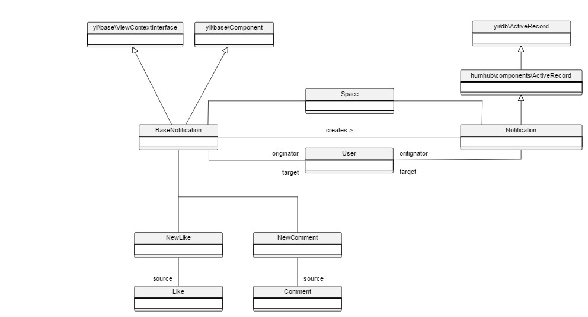

Notifications
=============

Notifications are used to inform one or a given set of users about a specific event, as the liking of a post or mentioning of a user, over multiple channels (e.g. web and mail). 

Custom notification types are derived from [[humhub\modules\notification\components\BaseNotification]] and can be assigned with an optional `$originator` user instance, which links
the notification to the user who triggered the event. Furthermore the [[humhub\modules\notification\components\BaseNotification|BaseNotification]] can be assigned with a `$source` attribute of type [[yii\db\ActiveRecord]], 
which links the notification to a source instance like a Content or ContentAddon (e.g. a Post or Like).

The BaseNotification is responsible for:

 - **instantiating** and **persisting** [[humhub\modules\notification\models\Notification]] model instances.
 - **rendering** the notification output for the differen output channels.



Examples for core notifications are:

 - [[humhub\modules\like\notifications\NewLike]]: is sent if an user likes a post or comment.
 - [[humhub\modules\user\notifications\Followed]]: is sent if an user follows another user.
 - [[humhub\modules\user\notifications\Mentioned]]: is sent if an user is mentioned within an post or comment.
 - [[humhub\modules\content\notifications\ContentCreated]]: is sent when content (e.g. a post) was created.

## Custom Notifications

#### Notification Class

Custom Notifications are derived from [[humhub\modules\notification\components\BaseNotification|BaseNotification]] and should reside in the `notifications` subfolder of your module's root directory.
The notification class at least has to overwrite the `$moduleId` variable with the id of your module and the `$viewName` with the name of the view which is used to render the notification.

```php
<?php

namespace johndoe\example\notifications;

use humhub\modules\notification\components\BaseNotification;

/**
 * Notifies a user about something happend
 */
class SomethingHappend extends BaseNotification
{
    // Module Id (required)
    public $moduleId = "example";

    // Viewname (required)
    public $viewName = "somethingHappend";
}
?>
```

#### Notification View

By default, the view of a notification should be located inside the subfolder `notifications/views`.
The view of our example is therefore located in `/modules/examples/notifications/views/somethingHappened.php`.

```php
<?php

use yii\helpers\Html;

echo Yii::t('SomethingHappend.views_notifications_somethingHappened', "%someUser% did something cool.", [
    '%someUser%' => '<strong>' . Html::encode($originator->displayName) . '</strong>'
]);
?>
```

> Info: If you require a different notification view for mails, you have to add an extra view file to a subfolder `notifications/views/mail`. 

## Send Notifications

After an event was triggered, you'll have to instantiate your custom [[humhub\modules\notification\components\BaseNotification|BaseNotification]] and call its
`send` or `sendBulk` function which will instantiate and persist a [[humhub\modules\notification\models\Notification]] instance for each user you want to notify.

A notification can optionally be assigned with a `$source` model instance (e.g. a post or comment related to the notification) which has to be derived from [[yii\db\ActiveRecord]].

```php
$notification = new \johndoe\example\notifications\SomethingHappend();

// Link to the object which fired the notification e.g. a SomethingHappened content-addon (optional)
$notification->source = $this;

// The user which triggered the notification (optional)
$notification->originator = $this->user;

// Send it to a set of users
$notification->sendBulk(User::find()->where([...]));

// or: a single user
$notification->send($user);
```
> Info: If the notification was created in the context of a space (e.g. `$source` is a Content, ContentAddon or ContentContainer) the `$space` variable is set with the corresponding space instance automatically.

> Info: The `send` and `sendBulk` will create and persist a [[humhub\modules\notification\models\Notification]] instance for each user.

> Tip: Notifications are often created and sent within the `afterSave` hook of the related `source` instance. This should be prefered over the instantiation within a controller.

> Note: Notifications are only sent by mail depending on the user's account settings.

## Delete Notifications

By default notifications will automatically be deleted after a given period of time or if the originator(user) object is removed.

Example for manual notification deletion:

```php
$notification = new johndoe\example\notifications\SomethingHappend();
$notification->source = $this;
$notification->delete(User::findOne(['id' => $userId]));
```