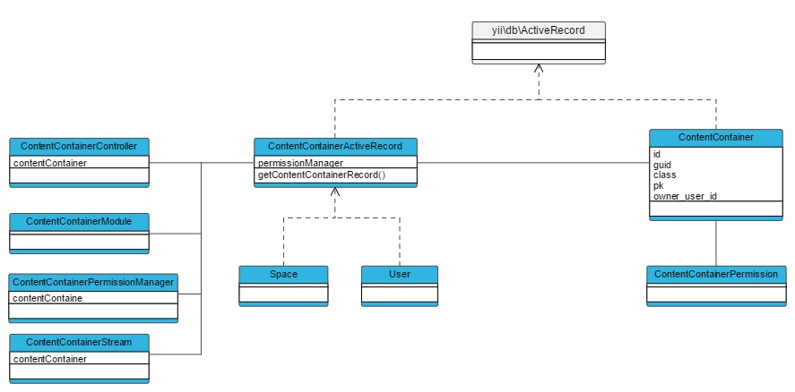

Content
=======

## ContentContainer

A [[humhub\modules\content\models\ContentContainer|ContentContainer]] in HumHub is the base concept for assigning content entries to a specific container instance (user or space).
Each [[humhub\modules\content\models\ContentContainer|ContentContainer]] is assigned with an unique guid, which is used in controllers to identify the context of its actions.

Currently there are two types of ContentContainer:
 
- [[humhub\modules\user\models\User|User]]
- [[humhub\modules\space\models\Space|Space]]



> Note: It's not possible to create own ContentContainer classes, yet.

### ContentContainerController

The [[humhub\modules\content\components\ContentContainerController|ContentContainerController]] class is extended by controllers working in the context of a specific [[humhub\modules\content\models\ContentContainer|ContentContainer]].
A [[humhub\modules\content\components\ContentContainerController|ContentContainerController]] will automatically search for a **sguid** (Space) or **uguid** (User) request parameter in every request and will instantiate the corresponding [[humhub\modules\content\models\ContentContainer|ContentContainer]].

The [[humhub\modules\content\components\ContentContainerController|ContentContainerController]] provides common tasks like:

- Automatic container loading based on URL
- Access checks
- Layout selection based on container type (User or Space)
- Create URL's for the given ContentContainer

For example:

```php
class ExampleController extends \humhub\modules\content\components\ContentContainerController
{
    public function actionIndex()
    {
        if ($this->contentContainer instanceof Space) {
            //Space related stuff...
        }
    }
}
```

Url's pointing to a ContentContainer action should be created by using the `createUrl()` function
of your ContentContainer instance. This will add the required sguid or uguid to your request.

```php
 // Direct ContentContainer call
 $space->createUrl('/module/controller/action');

 // Within a ContentContainerController:
 $this->contentContainer->createUrl('/module/controller/action');
```

> Note: Requests for a [[humhub\modules\content\components\ContentContainerController|ContentContainerController]] action without providing a sguid or uguid parameter will fail!

### ContentContainerActiveRecord

Each ContentContainer class is derived from [[\humhub\modules\content\components\ContentContainerActiveRecord]].
Beside others, this abstract class provides the following functionality:

- [Permission Management](dev-permissions.md) `getPermissionManager()`
- Profile-/Banner-image access `getProfileImage()`, `getProfileBannerImage()`
- Rendering the container stream `getWallOut()` (see [Permission Management](dev-stream.md))

Profile image example:

```php
//Get Profile Image Url
$profileImage = $space->getProfileImage();
if($profileImage->hasImage()) {
    $url = $profileImage->getUrl();
}
```

### ContentContainerModule

If a module should appear in the content containers module section, the module class must extend [[humhub\modules\content\components\ContentContainerModule]].
A ContentContainerModule can be enabled or disabled for a specific ContentContainer. The calendar module, for example, can be enabled for a specific space or a specific user account.

See the [[humhub\modules\content\components\ContentContainerModule]] class for a full list of  options.

Example of a modules `Module.php` file:

```php
class Module extends \humhub\modules\content\components\ContentContainerModule
{

    // Defines for which content container type this module is appropriate
    public function getContentContainerTypes()
    {
        // This content container can be assigned to Spaces and User
        return [
            Space::className(),
            User::className(),
        ];
    }

    // Is called when the whole module is disabled
    public function disable()
    {
        // Clear all Module data and call parent disable
        parent::disable();
    }

    // Is called when the module is disabled on a specific container
    public function disableContentContainer(ContentContainerActiveRecord $container)
    {
        parent::disableContentContainer($container);
        //Here you can clear all data related to the given container
    }

    // Can be used to define a specific description text for different container types
    public function getContentContainerDescription(ContentContainerActiveRecord $container)
    {
        if ($container instanceof Space) {
            return Yii::t('MyModule.base', 'Description related to spaces.');
        } elseif ($container instanceof User) {
            return Yii::t('MyModule.base', 'Description related to user.');
        }
    }
```
> Note: If you're working with content or other persistent data, make sure to delete container related data when the module is disabled on a contentcontainer. This can be archieved by overwriting the [[humhub\modules\content\components\ContentContainerModule::disableContentContainer]] function.


## Content

TBD

### ContentActiveRecord

Each Content ActiveRecord (derived from [[\humhub\modules\content\components\ContentActiveRecord]]) is automatically linked to a [[humhub\modules\content\models\Content]] record via the *content* attribute. 

This Content record holds all neccessary information and provides common methods:

- ContentContainer which the Content belongs to
- Meta Information (created_at, created_by, updated_at, updated_by)
- Wall Assignments / Methods
- Archiving / Pinning
- And more...

If you're implementing an ActiveRecord based on [[humhub\modules\content\components\ContentContainerActiveRecord]] you need to implement the following abstract methods:

- `getContentName()` - Returns the displayed name of the Content (e.g. Post or Poll)
- `getContentDescription()` - Returns a preview of the Content - which is used in Notifications for example.

Example:

```php
 (TBD)

```

#### Wall/Stream Output
(TBD)

#### Querying Content

If you're calling find() on a [[\humhub\modules\content\components\ContentActiveRecord]] instance you'll get a special [[\humhub\modules\content\components\ActiveQueryContent]] which provides additional methods to select content.

- contentContainer($container) - Find content only inside a given container
- readable($user) - Return only user readable content
- ...


### Controller

TBD

## ContentAddon

TBD

- Always linked to particual Content, inherits access rules from it
- Examples: Like, File, Comment
- Can be nested (e.g. Container -> Content -> Addon (Comment) -> Addon (Like)

### ActiveRecord

TBD

Provides access to the related content via *content *Attribute

### Controller

TBD
