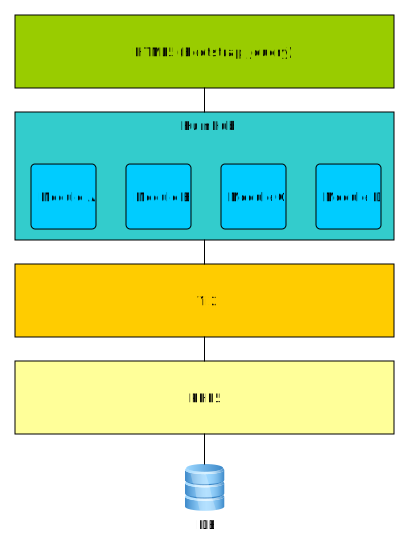

Overview
========

The main power of the HumHub platform lies in its flexibility and extensibility through modules and configuration of runtime behaviour.
HumHub is written mostly in PHP and is based on the [Yii Framework](http://www.yiiframework.com/). Other languages used throughout the platform are *JavaScript*, *HTML*, *SQL* and *CSS*. 

HumHub uses a [Model-View-Controller (MVC)](https://en.wikipedia.org/wiki/Model%E2%80%93view%E2%80%93controller) based software architecture and utilizes technologies such as [Yii2](http://www.yiiframework.com/), [jQuery](https://jquery.com/), [Bootstrap](http://getbootstrap.com/) and [Less](http://lesscss.org/), to name a few.

> Note: Since HumHub v1.2 the minimum PHP version is 5.6

As HumHub is based on the [Yii 2.0 PHP Framework](http://www.yiiframework.com/) make sure you're also familiar with the concepts of this framework in order to beeing able to write own modules or extend the core platform.

Here are some recommendet resources for learning Yii:

- [The Definitive Guide to Yii 2.0](http://www.yiiframework.com/doc-2.0/guide-index.html) 
- [Yii 2.0 Community Cookbook](https://yii2-cookbook.readthedocs.io/)

The HumHub core platform consists of several modules as well as extended Yii components:

**Core Components:**

 - [[humhub\components\ActiveRecord]]
 - [[humhub\components\Application]]
 - [[humhub\components\console\Application]]
 - [[humhub\components\AssetManager]] - 
 - [[humhub\components\Controller]]
 - [[humhub\components\Migration]]
 - [[humhub\components\Module]]
 - [[humhub\components\ModuleManager]]
 - [[humhub\components\Request]]
 - [[humhub\components\Response]]
 - [[humhub\components\SettingsManager]]
 - [[humhub\components\Theme]]
 - [[humhub\components\SocialActivity]]
 - [[humhub\components\View]]
 - [[humhub\components\Widget]]
 - **humhub\components\i18n**
 - **humhub\components\mail**
 - **humhub\components\queue**
 - **humhub\components\rendering**
 - **humhub\components\validators**

**Core Modules:**

 - **activity:**  User/Space activities
 - **admin:**  Responsible for admin/configuration related issues
 - **comment:**  Content addon for commenting
 - **content:**  Base module for all content types (Post,Wiki,...) 
 - **dashboard:**  Dashboard related functionality
 - **directory:**  Directory related functionality
 - **file:**  Basic file module for accessing the filesystem
 - **friendship:**  Friendship system functionality
 - **installer:**  HumHub installer module
 - **like:**  Content addon for likes
 - **live:**  Live frontend update functionality
 - **notification:**  User notifications (e.g. e-mail, web)
 - **post:**  Simple user-post related functionality
 - **search:**  Luceene Search Module
 - **space:**  Space related functionality
 - **stream:**  Content stream related functionality
 - **tour:**  HumHub user-guide tour
 - **user:**  User and authentication
