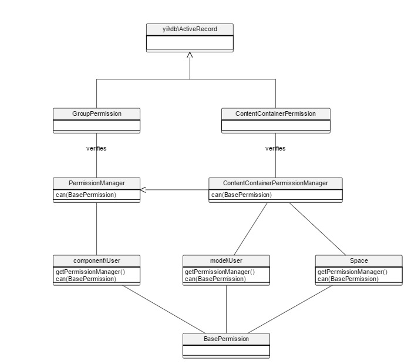

Permissions
========

Permissions in HumHub are used to grant users access to specific areas or functions of your network.



##Use Cases

 - Group A needs permission to manage the users of the network.
 - Moderators of Space A need write permissions for Module X.
 - User A only allows friend users to send him messages.

To achieve the permission management in such cases, HumHub provides an own group and contentcontainer level permission system.

There are two different types of permission: [[humhub\modules\user\models\GroupPermission]] and [[humhub\modules\content\models\ContentContainerPermission]].

## Verifying permissions

Permissions are verified by means of a [[humhub\modules\user\components\PermissionManager]]. 
There are two types of [[humhub\modules\user\components\PermissionManager|PermissionManager]], one for verifying [[humhub\modules\user\models\GroupPermission|GroupPermissions]]
and one for [[humhub\modules\content\models\ContentContainerPermission|ContentContainerPermissions]].

## Group Permissions

[[humhub\modules\user\models\GroupPermission|GroupPermissions]] are system wide permissions which can be assigned to system groups (Administration -> Users -> Groups).

Example of GroupPermissions `GroupPermissions are

 - [[humhub\modules\admin\permissions\ManageUsers]] - Permission to access the global user management section.
 - [[humhub\modules\admin\permissions\ManageGroups]] - Permission to access the global user group section.
 - [[humhub\modules\space\permissions\CreatePublicSpace]] - Permission to create public spaces.

### Verify Group Permissions

Group permissions of the current user can be verified by calling [[humhub\modules\user\components\User::can()]]:

```php
// Note that we are using the user component and not the user model here!
Yii::$app->user->can(MyPermission::class);

// or
Yii::$app->user->permissionManager->can(MyPermission::class);  

// or manually
// Note that you can leave the subject parameter if you want to verify against the currently logged in user model.
$permissionManager = new PermissionManager(['subject' => $myUserModel]);
$permissionManager->can(new MyPermission());
```

## Content Container Permissions

[[humhub\modules\content\models\ContentContainerPermission|ContentContainerPermissions]] are container (Space/User) specific permissions and can be assigned to 
so-called user-groups.

User user-groups:
    - `User::USERGROUP_SELF`: The permission container is the user instance itself.
    - `User::USERGROUP_FRIEND`: The permission container is a friend of the user.
    - `User::USERGROUP_USER`: The user is just a network member, but does not have any specific relationship with the permission container.
    - `User::USERGROUP_GUEST`: The user is a guest user and therefore has no relationship with the permission container.

Space user-groups:
    - `Space::USERGROUP_OWNER`: User is the owner of the space.
    - `Space::USERGROUP_ADMIN`: User is member of the space administrator group.
    - `Space::USERGROUP_MODERATOR`: User is member of the  space moderator group.
    - `Space::USERGROUP_MEMBER`: User is a simple member of the space.
    - `Space::USERGROUP_USER`: User is not a member of the space but a member of the network.
    - `Space::USERGROUP_GUEST`: User is not a member of the space nor a member of the network.

Example of `ContentContainerPermissions` are:

 - [[humhub\modules\space\permissions\InviteUsers]] - Permission to invite users to a space.
 - [[humhub\modules\mail\permissions\SendMail]] - Allows/Disallows other users to send messages.
 - [[humhub\modules\content\permissions\ManageContent]] - Permission to archive, pin to top or delete content within a space.

### Verify ContentContainer Permissions

```php
// check if the current user is allowed to send messages to user A
$userA->can(SendMail::class);

// check if the current user is allowed to manage content in spaceA
$spaceA->can(ManageContent::class);

// or
// Note the 'all' parameter is used in this example to require all given Permissions to be verified successfully instead of only one.
$permissionManager = new ContentContainerPermissionManager(['subject' => $myUserModel, 'contentContainer' => '$mySpace']);
$permissionManager->can([new MyPermissionA, new MyPermissionB], ['all' => true]);
```

## Custom Permissions

All permission classes are derived from [[humhub\libs\BasePermission]] and should reside in the `permissions` directory of your module. 
A [[humhub\libs\BasePermission]] subclass should at least overwrite the following attributes:

 - [[humhub\libs\BasePermission::id|BasePermission::id]] - A unique permission id.
 - [[humhub\libs\BasePermission::moduleId|BasePermission::moduleId]] - The moduleId this Permission belongs to.
 - [[humhub\libs\BasePermission::title|BasePermission::title]] - Permission title used to display the permission.
 - [[humhub\libs\BasePermission::description|BasePermission::description]] - Short description of the permission.

### Default State

By default a permission is only granted if either the [[humhub\libs\BasePermission::$defaultState|BasePermission::defaultState]] is set to [[humhub\libs\BasePermission::STATE_ALLOW|BasePermission::STATE_ALLOW]]
or if the given group is contained in the [[humhub\libs\BasePermission::defaultAllowedGroups|BasePermission::defaultAllowedGroups]] array.

The default state of a group can either be overwritten by setting a group state in the database

```php
// This is normally handled by the permission settings grid.
$user->getPermissionManager()->setGroupState(User::USERGROUP_USER, new SendMail(), BasePermission::STATE_ALLOW);
```

or by overwriting the default behaviour

```php
return [
...
    'params' => [
        // Grant SendMail permission for group User::USERGROUP_FRIEND
        'defaultPermissions' => [
            'humhub\modules\mail\permissions\SendMail' => [
                  'u_friend' => 1
            ]
        ]
    ],
...
];
```

### Fixed Groups

The default-state of a group can be fixated by overwriting the [[humhub\libs\BasePermission::fixedGroups|BasePermission::fixedGroups]] array within your permission class.
This will disable the edit capabilities of the given groups.

By default the following space user-groups are fixed:

- `Space::USERGROUP_GUEST`
- `Space::USERGROUP_OWNER`
- `Space::USERGROUP_ADMIN`

## Edit Permissions

If you plan to make your custom permissions editable, you have to return an array of all your module permissions within the 
[[humhub\components\Module::getPermissions()|Module::getPermissions()]] method of your Module.php. Your permissions will be added automatically to 
the permission grid of your content-container or to the global permission settings in case of group level permissions.

```php
public function getPermissions($contentContainer = null)
{
    if ($contentContainer instanceof Space) {
        return [
            new permissions\MySpacePermission()
        ];
    } elseif ($contentContainer instanceof User) {
        // This module does not provide yn user level permission
        return [];
    }

    return [
        new permissions\MyGroupPermission()
    ];
}
```

## Controller Access Permission

To restrict the access to a controller or specific controller actions your controller should overwrite the
 [[humhub\components\Controller::getAccessRules()]] function. This function should return an array of access rules as:

```php
class SpecialController extends Controller
{
    public function getAccessRules()
    {
        return [
            // This will block all controller actions for non loggedIn users.
            ['login'],
            // This will block the secret action for users without SpecialPermission
            ['permission' => [SpecialPermission::class, 'actions' => ['secret']]
        ]
    }

    public function actionIndex()
    {
        // Only accessible by logged in users
    }

    // Will only be allowed for users with SpecialPermission
    public function actionSecret()
    {
        // Only accessible by users with SpecialPermission permission
    }
}
```

The set of available rules is defined by the [[humhub\components\access\ControllerAccess]] which is defined by 
[[humhub\components\Controller::access]]. There are three `ControllerAccess` classes available:

 - `humhub\components\access\ControllerAccess` - default access control
 - `humhub\components\access\StrictAccess` - adds an additional restriction for guest users in non guest mode environments
 - `humhub\modules\content\components\ContentContainerControllerAccess` - default access control in `ContentContainerController`

In the following, we'll show some more use cases for the `getAccessRules` function:

Disable guest access for all controller actions:

```php
public function getAccessRules()
{
    return [
         ['login']
    ];
}
```

Disable guest access for specific controller actions:

```php
public function getAccessRules()
{
    return [
         ['login' => ['action1', 'action2']]
    ];
}
```

All users have to be logged in + additional permission check for 'action1' and 'action2':

```php
public function getAccessRules()
{
    return [
         ['login'],
         ['permission' => MyPermission::class, 'actions' => ['action1', 'action2']]
    ];
}
```

Custom inline validator for action 'action1':

```php
public function getAccessRules()
{
    return [
         ['validateMyCustomRule', 'someParameter' => 'someValue', 'actions' => ['action1']]
    ];
}

public function validateMyCustomRule($rule, $access)
{
    if($rule['someParameter'] !== 'someValue') {
         $access->code = 401;
         $access->reason = 'Not authorized!';
         return false;
    }

     return true;
}
```

### ContentContainerControllerAccess

The `ContentContainerControllerAccess` used in `ContentContainerController` provides some additional access rules as:

 - `ContentContainerControllerAccess::RULE_SPACE_ONLY` restrict to space requests
 - `ContentContainerControllerAccess::RULE_PROFILE_ONLY` restrict to user account requests
 - `ContentContainerControllerAccess::RULE_USER_GROUP_ONLY` restricts the access to a given level of container groups

The following example restricts the access for non members of a space. Note the USERGROUP_MEMBER should specify the
minimum user group level which should be able to access the controller/actions. 

```php
public function getAccessRules()
{
    return [
        [ContentContainerControllerAccess::RULE_USER_GROUP_ONLY => [Space::USERGROUP_MEMBER]]
    ];
}
```

## Guest Access

Since HumHub can also be operated in guest mode, you have to consider that a call to `Yii::$app->user->getIdentity()` may return a `null` value.
Therefore you should either block guest access in your controllers (see [Controller Access](#controller-access-permission)) or add a check for
`Yii::$app->user->isGuest` before accessing your user identity. 

See the [User Section](modules-users.md) for more information and examples about how to use the user component.

> Note: Global controllers (non ContentContainerController) should be protected by `StrictAccess`

> Note: Remember to hide view components as buttons and menus which are not accessible by guest users.

> Note: If the guest mode is active, guest users are allowed to access public content.

