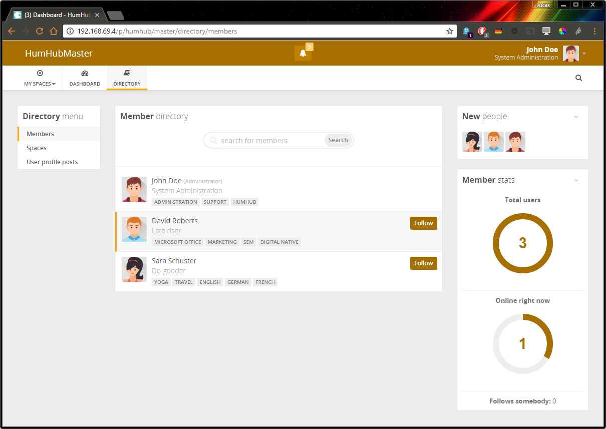
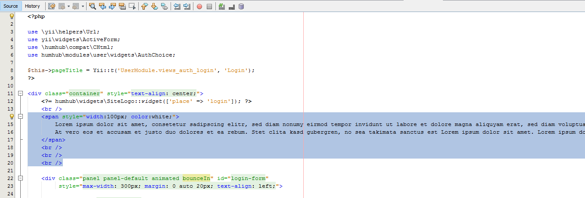
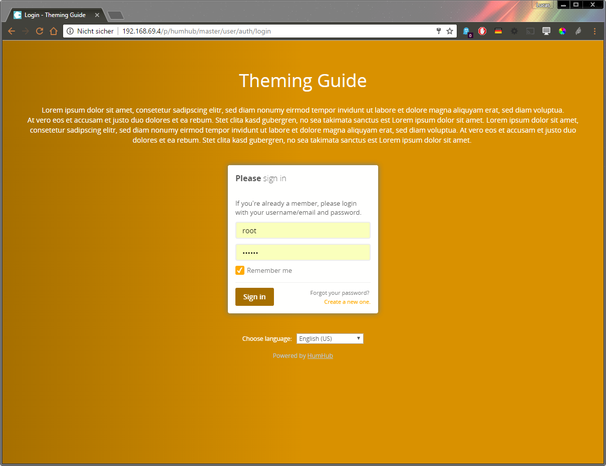

Tutorial
========


Foreword
--------

This quick tutorial shows you all necessary steps to create a custom **HumHub** theme.

- Step 1: Create a theme folder ([Theme Folder Structure](structure.md))
- Step 2: Adjust colors and build CSS ([Custom Stylesheets](css.md))
- Step 3: Modify login template ([View Files](views.md))


Step 1: Create an own theme folder
---------------------------------

- Go to the HumHub installation directory
- Switch to the directory `themes`
- Copy the folder `HumHub` and rename it to `Example`
- Enable the new `Example` theme under `Administration -> Settings -> Appearance`


Step 2: Adjust colors and build CSS 
-----------------------------------

### Installing prerequisites 

** Install NodeJS ** 

See: https://nodejs.org/en/download/

** Install LESS **

Open the command console and execute:

```
npm -g install less
```

### Modify theme colors

Add modifed color variables to the file `/themes/Example/less/variables.less`.

```
@default: #ededed;
@primary: #A66F00;
@info: #FFAA00;
@success: #97d271;
@warning: #fdd198;
@danger: #FFD073;
```

### Compile LESS file

Open the command console and change to the themes `less` directory

``` 
cd /path/to/HumHub/themes/Example/less
```

Build the CSS package

```
lessc build.less ../css/theme.css
```

### Test the result

- Flush your browsers cache
- Flush the HumHub cache (if enabled): `Administration -> Settings -> Advanced -> Cache -> Flush`
- Fully reload the page




Step 3: Modify login template
------------------------------

In this step we're adding some text to the login template.

### Create a themed view file

Copy the view file `humhub/modules/user/views/auth/login.php` to `Example/views/user/auth/login.php`

### Modify the view file

Add some additional text below the application name.

```php
<span style="width:100px; color:white;">
    Lorem ipsum dolor sit amet, consetetur sadipscing elitr, sed diam nonumy eirmod tempor invidunt ut labore et dolore magna aliquyam erat, sed diam voluptua.<br />
    At vero eos et accusam et justo duo dolores et ea rebum. Stet clita kasd gubergren, no sea takimata sanctus est Lorem ipsum dolor sit amet. Lorem ipsum dolor sit 
    amet, consetetur sadipscing elitr, sed diam nonumy eirmod tempor invidunt ut labore et dolore magna aliquyam erat, sed diam voluptua. At vero eos et accusam et 
    justo duo dolores et ea rebum. Stet clita kasd gubergren, no sea takimata sanctus est Lorem ipsum dolor sit amet.
</span>
<br />
<br />
<br />
```

Text Example:



### Result


 


